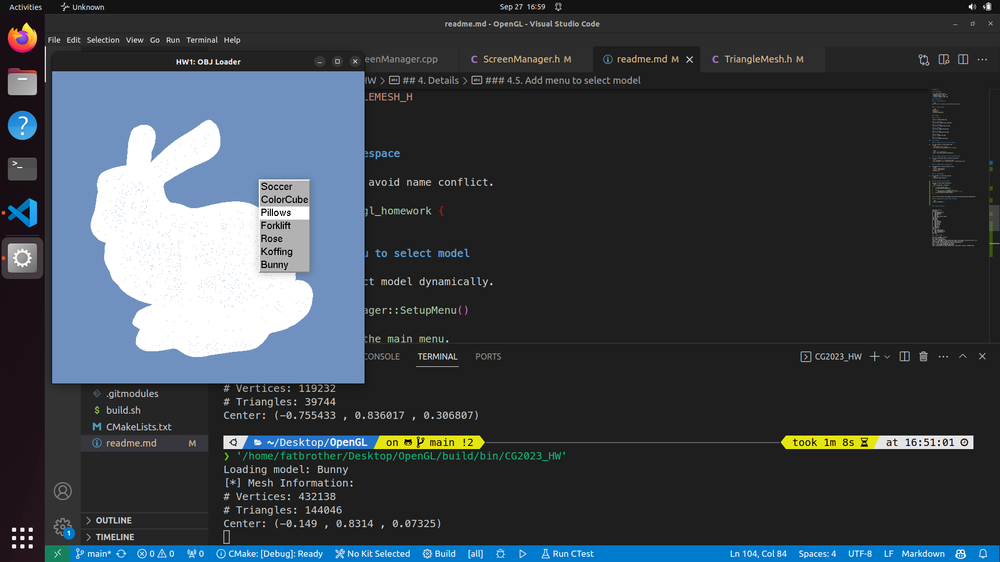
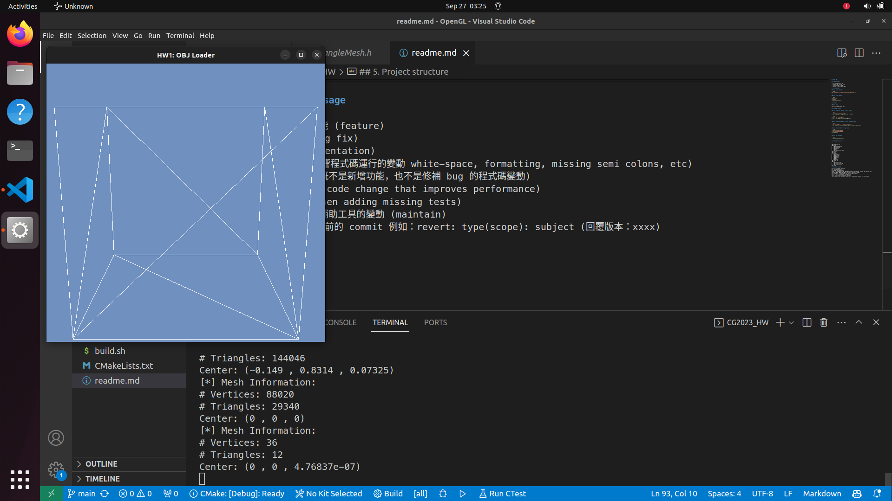

# Details of implementation

- [Details of implementation](#details-of-implementation)
  - [HW1 Object Loader](#hw1-object-loader)
    - [1. Smart pointer](#1-smart-pointer)
    - [2. C++17 filesystem::path](#2-c17-filesystempath)
    - [3. Pragma once](#3-pragma-once)
    - [Namespace](#namespace)
    - [5. Select model menu](#5-select-model-menu)
    - [6. Encapsulate glut functions](#6-encapsulate-glut-functions)
    - [7. Template wrap function](#7-template-wrap-function)
    - [8. Load model](#8-load-model)
    - [9. Private implementation](#9-private-implementation)
  - [10. Result](#10-result)
  - [HW2 Light and Shading](#hw2-light-and-shading)
    - [1. Shader implementation](#1-shader-implementation)
    - [2. Light](#2-light)
    - [3. Scene update](#3-scene-update)
    - [4. Timer](#4-timer)


## HW1 Object Loader

### 1. Smart pointer

Use smart pointer to avoid memory leak.

```diff
- TriangleMesh* mesh = nullptr;
+ std::unique_ptr<TriangleMesh> mesh = nullptr;
```

```diff
- mesh = new TriangleMesh();
+ mesh = std::make_unique<TriangleMesh>();
```

### 2. C++17 filesystem::path

Use c++17 filesystem::path to avoid hard code path.

```diff
- std::string path = "../models/Bunny.obj";
+ auto modelPath = std::filesystem::path("../models/Bunny.obj");
```

### 3. Pragma once

Use pragma once to avoid multiple include.

```diff
- #ifndef TRIANGLEMESH_H
- #define TRIANGLEMESH_H
+ #pragma once
```

###  Namespace

Use namespace to avoid name conflict.

```diff
+ namespace opengl_homework {
```

### 5. Select model menu

Add menu to select model dynamically.

```diff
+ void ScreenManager::SetupMenu()
+ {
+     // Create the main menu.
+     glutCreateMenu(MenuCBWrapper);
+     
+     for (int i = 0; i < m_objNames.size(); i++) 
+         glutAddMenuEntry(m_objNames[i].c_str(), i + 1);
+     glutAttachMenu(GLUT_RIGHT_BUTTON);
+ }
```



### 6. Encapsulate glut functions

Encapsulate the code of glut functions to ScreenManager class.

```diff
+ class ScreenManager {
```

### 7. Template wrap function

Use template to wrap member function to glut callback function.

```diff
+ template<typename... Args>
+ static auto StaticWrapper(void(ScreenManager::*func)(Args...)) {
+     static void(ScreenManager::*s_func)(Args...) = func;
+     return [](Args... args) { (GetInstance().get()->*s_func)(args...); };
+ }
```

### 8. Load model

Preprocess the model file and store with vector.

`Maybe it's not a good idea to store all models in memory if there are too many models, but it's ok for this homework because the total size of all models is only 100k vertices.`

```diff
+ using MeshPtr = std::shared_ptr<opengl_homework::TriangleMesh>;
+ std::vector<MeshPtr> m_meshes;
+ MeshPtr m_currentMesh;
```

Use thread to load model asynchronously.

```diff
+ // find the minimum bytes size of the obj files and swap it to the first position
+ int min = INT_MAX;
+ int minIndex = 0;
+ for (int i = 0; i < m_objNames.size(); i++) {
+     auto size = std::filesystem::file_size("models/" + m_objNames[i] + ".obj");
+     if (size < min) {
+         min = size;
+         minIndex = i;
+     }
+ }
+ std::swap(m_objNames[0], m_objNames[minIndex]);
+ 
+ // Load all obj files.
+ auto basePath = std::filesystem::path("models");
+ m_meshes.resize(m_objNames.size());
+ 
+ // Load first model in the main thread.
+ auto firstFilePath = basePath / (m_objNames[0] + ".obj");
+ m_meshes[0] = std::make_shared<TriangleMesh>(firstFilePath, true);
+ m_meshes[0]->ApplyTransformCPU(MVP);
+ 
+ auto threadFunc = [](
+     int i,
+     const std::filesystem::path& basePath,
+     const std::vector<std::string>& m_objNames,
+     const glm::mat4x4& MVP,
+     std::vector<MeshPtr>& m_meshes) {
+         auto filePath = basePath / (m_objNames[i] + ".obj");
+         m_meshes[i] = std::make_shared<TriangleMesh>(filePath, true);
+         m_meshes[i]->ApplyTransformCPU(MVP);
+     };
+ for (int i = 1; i < m_objNames.size(); i++) {
+     std::thread thread(threadFunc, i, basePath, m_objNames, MVP, std::ref(m_meshes));
+     thread.detach();
+ }
```

### 9. Private implementation

Use pimpl idiom to hide implementation details.

It's also have the benefit of reducing compile time, because the header file doesn't need to include all the implementation details.

```diff
+ struct Impl;
+ std::unique_ptr<Impl> pImpl;
```

## 10. Result





## HW2 Light and Shading

### 1. Shader implementation

Because the shader code is too easy to be copied(X, so I add face culling to the back faces in the geometry shader to have a better performance.

See the [Vertex Shader](./shaders/phong_shading_demo.vs), [Geometry Shader](./shaders/face_culling.gs) and [Fragment Shader](shaders/phong_shading_demo.fs) for more details.

```diff
+ #version 330 core
+ 
+ layout (triangles) in;
+ layout (triangle_strip, max_vertices = 3) out;
+ 
+ in vec3 vPosition[];
+ in vec3 vNormal[];
+ in vec3 vColor[];
+ 
+ out vec3 fColor;
+ 
+ void main() {
+     vec3 normal = normalize(cross(vPosition[1] - vPosition[0], vPosition[2] - vPosition[0]));
+     if (dot(normal, vPosition[0]) > 0) {
+         return;
+     }
+ 
+     for (int i = 0; i < 3; i++) {
+         fColor = vColor[i];
+         gl_Position = gl_in[i].gl_Position;
+         EmitVertex();
+     }
+     EndPrimitive();
+ }
```

### 2. Light

Because I use smart ptr in this project, so I can't just pass the light object to the shader directly.

I use a template struct to determine the type of light and store the light object in the struct.

```diff
+ template<typename T, 
+     typename = std::enable_if<std::is_base_of<PointLight, T>::value>>
+ struct SceneLight
+ {
+     SceneLight() {
+         light = nullptr;
+         worldMatrix = glm::mat4x4(1.0f);
+         visColor = glm::vec3(1.0f, 1.0f, 1.0f);
+     }
+     std::shared_ptr<T> light;
+     glm::mat4x4 worldMatrix;
+     glm::vec3 visColor;
+ };
```

### 3. Scene update

Use ```Update()``` function to update the scene more flexibly.

```diff
+ void Update(const glm::mat4& transform) {
+     worldMatrix = transform * worldMatrix;
+ }
```

```diff
- pImpl->sceneObj->worldMatrix = S * R;

+ pImpl->sceneObj->Update(R);
```

### 4. Timer

Use timer to calculate the elapsed time.

Use it to rotate the model with same speed on different computers.

```diff
+ static auto lastTime = std::chrono::high_resolution_clock::now();
+ 
+ auto currentTime = std::chrono::high_resolution_clock::now();
+ float deltaTime = std::chrono::duration_cast<std::chrono::milliseconds>(currentTime - lastTime).count() / 1000.0f;
+ lastTime = currentTime;
```

```diff
+ // Rotate the model.
+ auto rotationAxis = glm::vec3(0.0f, 1.0f, 0.0f);
+ auto rotationAngle = 0.1f * deltaTime;
+ glm::mat4x4 R = glm::rotate(glm::mat4x4(1.0f), rotationAngle, rotationAxis);
+ pImpl->sceneObj->Update(R);
```