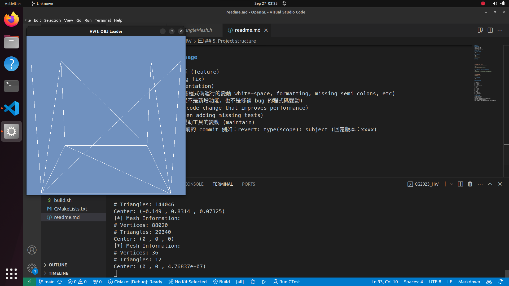
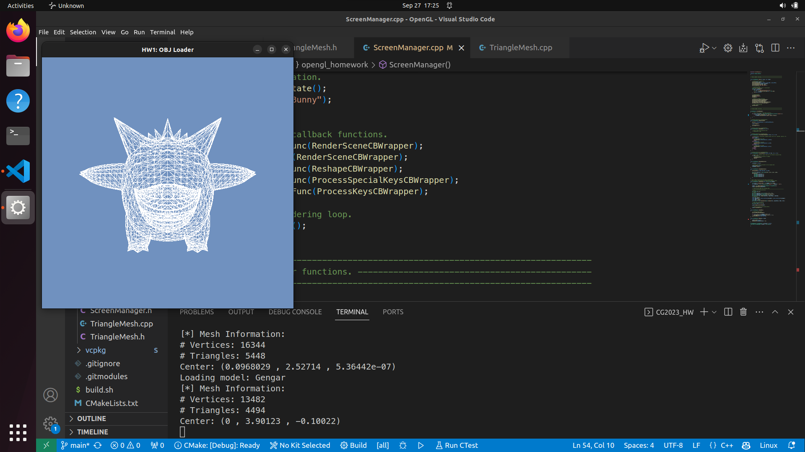
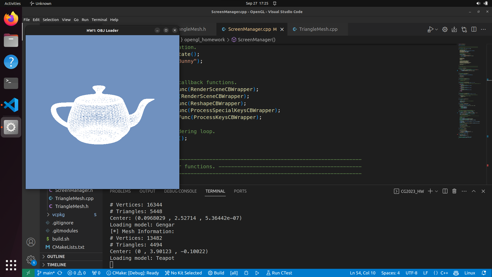

# OpenGL HW

## 1. Environment

### 1.1. Linux

* OS: Linux Ubuntu 22.04
* Compiler: g++ 11.4.0, C++17
* Package Manager: vcpkg
* Library: freeglut, glew, glm

### 1.2. Windows

* OS: Windows 11
* Shell: PowerShell 7.2.1
* Compiler: MSVC, C++17
* Package Manager: vcpkg
* Library: freeglut, glew, glm

## 2. Build & Run

### 2.1. Run on Linux

```bash
git clone https://github.com/fatbrother/OpenGL-HW.git
cd OpenGL-HW

git submodule update --init
vcpkg/bootstrap-vcpkg.sh
./vcpkg/vcpkg install freeglut glew glm

./build.sh
./build/bin/CG2023_HW
```

### 2.2. Run on Windows

```bash
git clone https://github.com/fatbrother/OpenGL-HW.git
cd OpenGL-HW

git submodule update --init
vcpkg/bootstrap-vcpkg.bat
./vcpkg/vcpkg install freeglut glew glm

./build.bat
./build/bin/Release/CG2023_HW.exe
```

## 3. Result

### 3.1. Bunny


### 3.2. ColorCube



### 3.3. Forklift


### 3.4. Koffing


### 3.5. Gengar



### 3.6. Teapot



## 4. Details

### 4.1. Smart pointer

Use smart pointer to avoid memory leak.

```diff
- TriangleMesh* mesh = nullptr;
+ std::unique_ptr<TriangleMesh> mesh = nullptr;
```

```diff
- mesh = new TriangleMesh();
+ mesh = std::make_unique<TriangleMesh>();
```

### 4.2. C++17 filesystem::path

Use c++17 filesystem::path to avoid hard code path.

```diff
- std::string path = "../models/Bunny.obj";
+ auto modelPath = std::filesystem::path("../models/Bunny.obj");
```

### 4.3. Pragma once

Use pragma once to avoid multiple include.

```diff
- #ifndef TRIANGLEMESH_H
- #define TRIANGLEMESH_H
+ #pragma once
```

### 4.4. Namespace

Use namespace to avoid name conflict.

```diff
+ namespace opengl_homework {
```

### 4.5. Select model menu

Add menu to select model dynamically.

```diff
+ void ScreenManager::SetupMenu()
+ {
+     // Create the main menu.
+     glutCreateMenu(MenuCBWrapper);
+     
+     for (int i = 0; i < m_objNames.size(); i++) 
+         glutAddMenuEntry(m_objNames[i].c_str(), i + 1);
+     glutAttachMenu(GLUT_RIGHT_BUTTON);
+ }
```


### 4.6. Encapsulate glut functions

Encapsulate the code of glut functions to ScreenManager class.

```diff
+ class ScreenManager {
```

### 4.7. Template wrap function

Use template to wrap member function to glut callback function.

```diff
+ template<typename... Args>
+ static auto StaticWrapper(void(ScreenManager::*func)(Args...)) {
+     static void(ScreenManager::*s_func)(Args...) = func;
+     return [](Args... args) { (GetInstance().get()->*s_func)(args...); };
+ }
```

### 4.8. Load model

Preprocess the model file and store with vector.

```diff
+ using MeshPtr = std::shared_ptr<opengl_homework::TriangleMesh>;
+ std::vector<MeshPtr> m_meshes;
+ MeshPtr m_currentMesh;
```

Use thread to load model asynchronously.

```diff
+ // find the minimum bytes size of the obj files and swap it to the first position
+ int min = INT_MAX;
+ int minIndex = 0;
+ for (int i = 0; i < m_objNames.size(); i++) {
+     auto size = std::filesystem::file_size("models/" + m_objNames[i] + ".obj");
+     if (size < min) {
+         min = size;
+         minIndex = i;
+     }
+ }
+ std::swap(m_objNames[0], m_objNames[minIndex]);
+ 
+ // Load all obj files.
+ auto basePath = std::filesystem::path("models");
+ m_meshes.resize(m_objNames.size());
+ 
+ // Load first model in the main thread.
+ auto firstFilePath = basePath / (m_objNames[0] + ".obj");
+ m_meshes[0] = std::make_shared<TriangleMesh>(firstFilePath, true);
+ m_meshes[0]->ApplyTransformCPU(MVP);
+ 
+ auto threadFunc = [](
+     int i,
+     const std::filesystem::path& basePath,
+     const std::vector<std::string>& m_objNames,
+     const glm::mat4x4& MVP,
+     std::vector<MeshPtr>& m_meshes) {
+         auto filePath = basePath / (m_objNames[i] + ".obj");
+         m_meshes[i] = std::make_shared<TriangleMesh>(filePath, true);
+         m_meshes[i]->ApplyTransformCPU(MVP);
+     };
+ for (int i = 1; i < m_objNames.size(); i++) {
+     std::thread thread(threadFunc, i, basePath, m_objNames, MVP, std::ref(m_meshes));
+     thread.detach();
+ }
```

## 5. Project structure

```text
.
├── CMakeLists.txt
├── build
│   ├── CMakeCache.txt
│   ├── CMakeFiles
│   ├── Makefile
│   ├── bin
│   │   └── CG2023_HW
│   └── cmake_install.cmake
├── build.sh
├── images
│   ├── bunny.png
│   ├── cube.png
│   ├── forklift.png
│   ├── gengar.png
│   ├── koffing.png
│   ├── menu.png
│   └── teapot.png
├── models
│   ├── Bunny.obj
│   ├── Cube.obj
│   ├── Forklift.obj
│   ├── Gengar.obj
│   ├── Koffing.obj
│   └── Teapot.obj
├── readme.md
├── src
│   ├── CG2023_HW.cpp
│   ├── ScreenManager.cpp
│   ├── ScreenManager.h
│   ├── TriangleMesh.cpp
│   └── TriangleMesh.h
└── vcpkg
```

## 6. Commit message

feat: 新增/修改功能 (feature)  
fix: 修補 bug (bug fix)  
docs: 文件 (documentation)  
style: 格式 (不影響程式碼運行的變動 white-space, formatting, missing semi colons, etc)  
refactor: 重構 (既不是新增功能，也不是修補 bug 的程式碼變動)  
perf: 改善效能 (A code change that improves performance)  
test: 增加測試 (when adding missing tests)  
chore: 建構程序或輔助工具的變動 (maintain)  
revert: 撤銷回覆先前的 commit 例如：revert: type(scope): subject (回覆版本：xxxx)  
