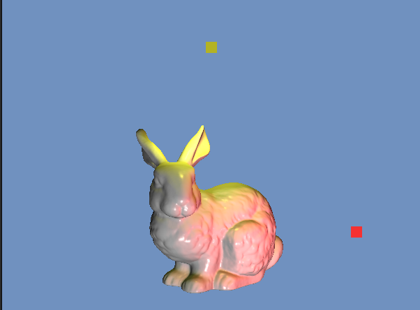

# OpenGL HW



- [OpenGL HW](#opengl-hw)
  - [0. Introduction](#0-introduction)
  - [1. Environment](#1-environment)
    - [1.1. Linux](#11-linux)
    - [1.2. Windows](#12-windows)
  - [2. Build \& Run](#2-build--run)
    - [2.1. Run on Linux](#21-run-on-linux)
    - [2.2. Run on Windows](#22-run-on-windows)
  - [4. Details](#4-details)
  - [5. Project structure](#5-project-structure)
  - [6. Commit message](#6-commit-message)

## 0. Introduction

This is a homework of CG2023 Computer Graphics course in NTPU, Taiwan.

In this project, I implemented a simple 3D model viewer with OpenGL.

The project includes:

- Object loading
- Camera control
- Light control
- Shader implementation

## 1. Environment

### 1.1. Linux

- OS: Linux Ubuntu 22.04
- Compiler: g++ 11.4.0, C++20
- Package Manager: vcpkg
- Library: freeglut, glew, glm

### 1.2. Windows

- OS: Windows 11
- Shell: PowerShell 7.2.1
- Compiler: MSVC, C++20
- Package Manager: vcpkg
- Library: freeglut, glew, glm

## 2. Build & Run

### 2.1. Run on Linux

```bash
git clone https://github.com/fatbrother/OpenGL-HW.git
cd OpenGL-HW

git submodule update --init --recursive
vcpkg/bootstrap-vcpkg.sh
./vcpkg/vcpkg install freeglut glew glm

./build.sh
./build/bin/CG2023_HW
```

### 2.2. Run on Windows

```bash
git clone https://github.com/fatbrother/OpenGL-HW.git
cd OpenGL-HW

git submodule update --init
vcpkg/bootstrap-vcpkg.bat
./vcpkg/vcpkg install freeglut glew glm

./build.bat
./build/bin/Release/CG2023_HW.exe
```

## 4. Details

See the [CHANGELOG](./CHANGELOG) and [DETAILS](./details.md) for more implementation details.

## 5. Project structure

```text
.
├── CHANGELOG
├── CMakeLists.txt
├── LICENSE
├── build
├── build.bat
├── build.sh
├── images
├── models
│   ├── Bunny
│   ├── ColorCube
│   ├── Forklift
│   ├── Gengar
│   ├── Ivysaur
│   ├── Koffing
│   ├── Pillows
│   ├── Rose
│   └── Soccer
├── readme.md
├── shaders
│   ├── face_culling.gs
│   ├── fixed_color.fs
│   ├── fixed_color.vs
│   ├── phong_shading_demo.fs
│   └── phong_shading_demo.vs
├── src
│   ├── CG2023_HW.cpp
│   ├── Camera.cpp
│   ├── Camera.h
│   ├── Light.h
│   ├── Material.h
│   ├── ScreenManager.cpp
│   ├── ScreenManager.h
│   ├── ShaderProg.cpp
│   ├── ShaderProg.h
│   ├── TriangleMesh.cpp
│   └── TriangleMesh.h
└── vcpkg
```

## 6. Commit message

feat: 新增/修改功能 (feature)  
fix: 修補 bug (bug fix)  
docs: 文件 (documentation)  
style: 格式 (不影響程式碼運行的變動 white-space, formatting, missing semi colons, etc)  
refactor: 重構 (既不是新增功能，也不是修補 bug 的程式碼變動)  
perf: 改善效能 (A code change that improves performance)  
test: 增加測試 (when adding missing tests)  
chore: 建構程序或輔助工具的變動 (maintain)  
revert: 撤銷回覆先前的 commit 例如：revert: type(scope): subject (回覆版本：xxxx)  
