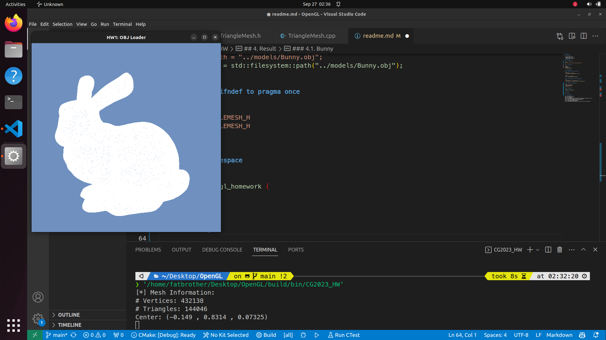
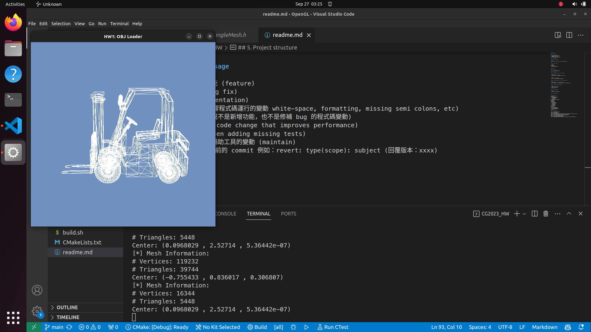
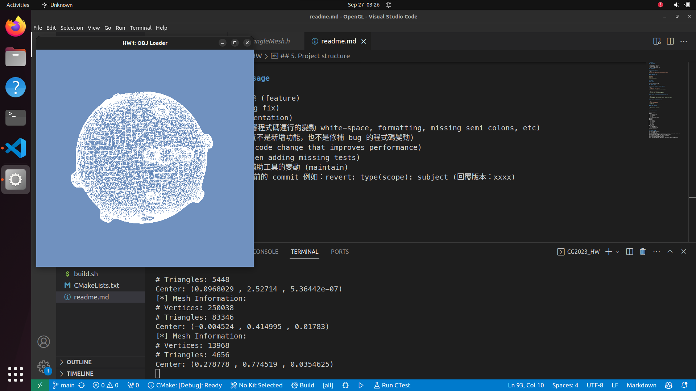
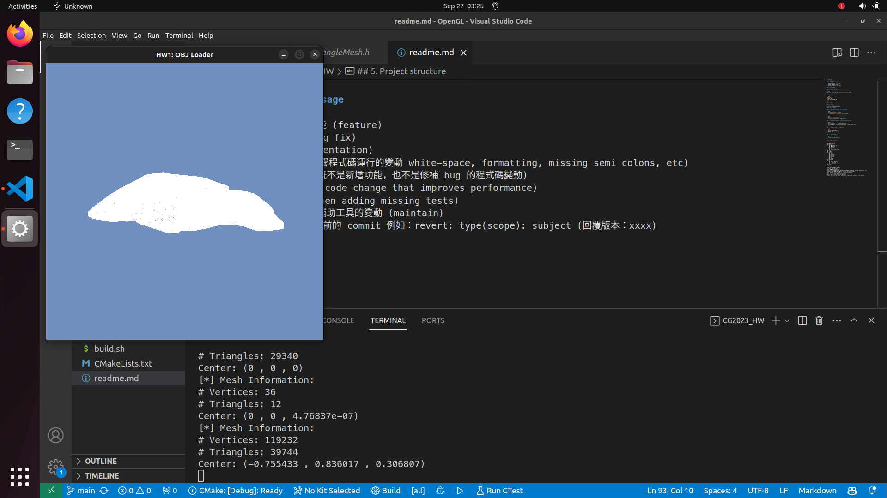
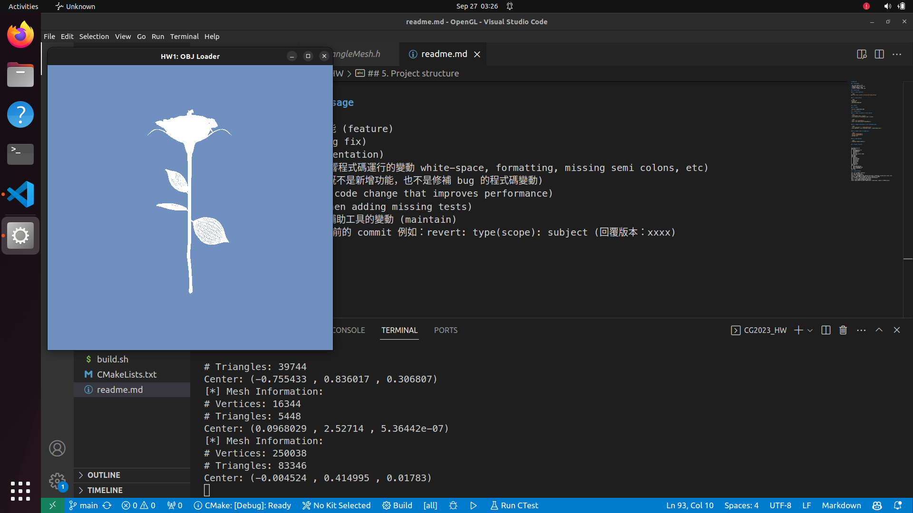
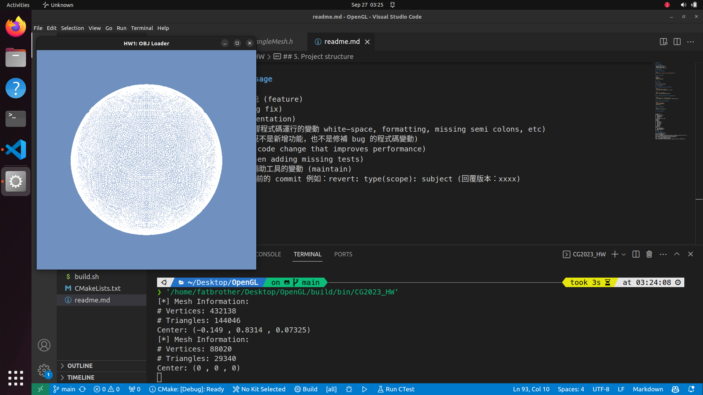

# OpenGL HW

## 1. Environment

* OS: Linux Ubuntu 22.04
* Compiler: g++ 11.4.0, C++17
* Package Manager: vcpkg
* Library: freeglut, glew, glm

## 2. Build & Run

### 2.1. Clone repository

```bash
git clone https://github.com/fatbrother/OpenGL-HW.git
```

### 2.2. Build and Run

```bash
cd OpenGL-HW
./build.sh
./build/bin/CG2023_HW
```

## 3. Result

### 4.1. Bunny



## 4.2. ColorCube


## 4.3. Forklift


## 4.4. Koffing


## 4.5. Pillows


## 4.6. Rose


## 4.7. Soccer


## 4. Change details

### 4.1. Change raw pointer to smart pointer

```diff
- TriangleMesh* mesh = nullptr;
+ std::unique_ptr<TriangleMesh> mesh = nullptr;
```

```diff
- mesh = new TriangleMesh();
+ mesh = std::make_unique<TriangleMesh>();
```

### 4.2. Change string path to c++17 filesystem::path

```diff
- std::string path = "../models/Bunny.obj";
+ auto modelPath = std::filesystem::path("../models/Bunny.obj");
```

### 4.3. Change ifndef to pragma once

```diff
- #ifndef TRIANGLEMESH_H
- #define TRIANGLEMESH_H
+ #pragma once
```

### 4.4. Add namespace

```diff
+ namespace opengl_homework {
```

## 5. Project structure

```
.
├── CMakeLists.txt
├── build
│   ├── CMakeCache.txt
│   ├── CMakeFiles
│   ├── Makefile
│   ├── bin
│   └── cmake_install.cmake
├── build.sh
├── images
├── models
│   ├── Bunny
│   ├── ColorCube
│   ├── Forklift
│   ├── Koffing
│   ├── Pillows
│   ├── Rose
│   └── Soccer
├── readme.md
├── src
│   ├── CG2023_HW.cpp
│   ├── TriangleMesh.cpp
│   └── TriangleMesh.h
└── vcpkg
```
## 6. Commit message

feat: 新增/修改功能 (feature)  
fix: 修補 bug (bug fix)  
docs: 文件 (documentation)  
style: 格式 (不影響程式碼運行的變動 white-space, formatting, missing semi colons, etc)  
refactor: 重構 (既不是新增功能，也不是修補 bug 的程式碼變動)  
perf: 改善效能 (A code change that improves performance)  
test: 增加測試 (when adding missing tests)  
chore: 建構程序或輔助工具的變動 (maintain)  
revert: 撤銷回覆先前的 commit 例如：revert: type(scope): subject (回覆版本：xxxx)  